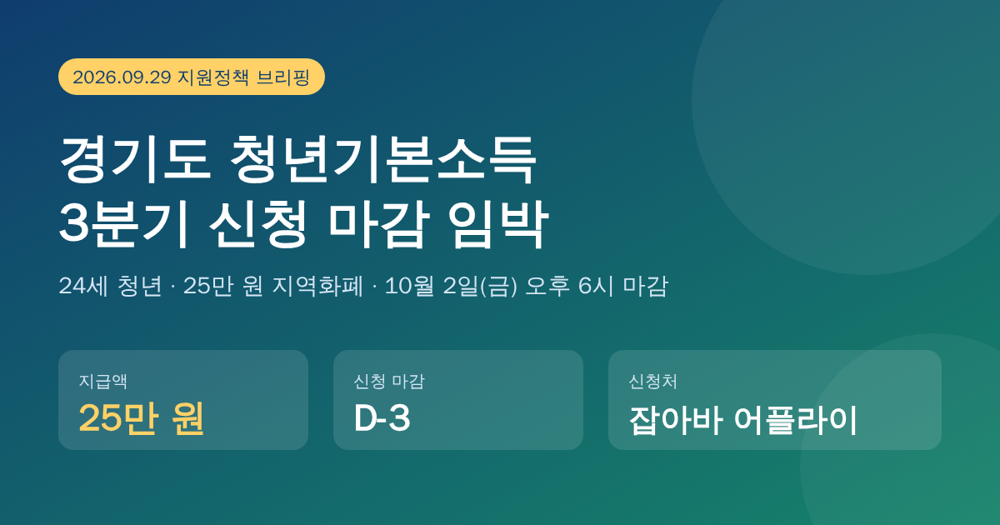
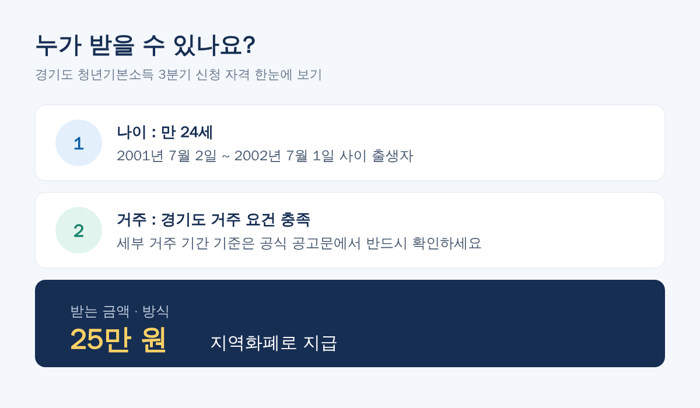
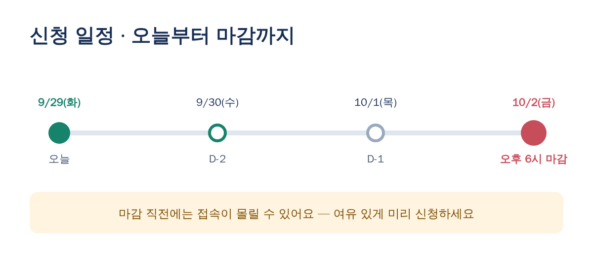
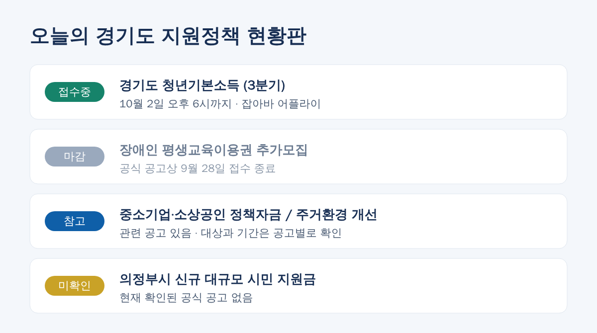

# [경기도 지원정책] 청년기본소득 3분기 신청 D-3! 24세라면 25만 원 꼭 챙기세요

안녕하세요! 오늘(9월 29일) 확인한 경기도 지원정책 소식을 정리했습니다.
가장 중요한 건 **경기도 청년기본소득 3분기 신청이 10월 2일(금) 오후 6시에 마감**된다는 점이에요. 해당되는 분이라면 이번 주 안에 꼭 신청하세요.

---

## 1. 경기도 청년기본소득 3분기 (접수 중)

| 항목 | 내용 |
|---|---|
| 대상 | 경기도 거주 요건을 충족하는 **만 24세 청년** |
| 출생일 기준 | **2001년 7월 2일 ~ 2002년 7월 1일** 출생 |
| 지원 금액 | **25만 원** |
| 지급 방식 | 지역화폐 |
| 신청 기간 | **~ 10월 2일(금) 오후 6시** |
| 신청처 | 잡아바 어플라이 (경기도 일자리재단) |

**체크 포인트**
- 출생일이 위 기간 안에 들어가는지 먼저 확인하세요.
- 거주 기간 등 세부 요건은 공식 공고문에서 확인하는 게 가장 정확합니다.
- 지역화폐로 지급되므로, 사용처와 사용 기한도 함께 챙겨 두세요.

마감 직전에는 신청이 몰려 접속이 느려질 수 있으니 **하루라도 일찍 신청하는 것**을 추천드려요.

> 출처: 안산시청 공지 (ansan.go.kr)

---

## 2. 경기도 장애인 평생교육이용권 추가모집 (마감)

오늘 아침 알림에 이 사업도 포함되어 있었는데, **공식 공고상 접수 기간이 9월 28일까지**라서 **이미 마감**됐습니다.
이번에 놓치셨다면 다음 모집 공고를 기다려야 합니다. 평생교육이용권 누리집을 즐겨찾기해 두면 편해요.

> 출처: 평생교육이용권 누리집 (lllcard.kr)

---

## 3. 그 밖의 소식

- **중소기업·소상공인 정책자금**: 관련 공고가 나와 있습니다. 공고마다 지원 대상과 접수 기간이 다르니 개별 공고를 확인하세요.
- **경기도 주거환경 개선 사업**: 관련 사업이 진행 중입니다. 자격과 신청 방법은 공고문에서 확인하세요.
- **의정부시 신규 대규모 시민 지원금**: 현재 **공식적으로 확인된 공고는 없습니다.** SNS 등에 떠도는 내용은 시청 공식 공지로 한 번 더 확인하세요.

---

## 한 줄 요약

✅ **24세 경기도 청년 → 10월 2일 오후 6시까지 잡아바 어플라이에서 청년기본소득 25만 원 신청!**
❌ 장애인 평생교육이용권 추가모집은 9월 28일 마감
ℹ️ 정책자금·주거환경 개선은 공고별로 확인, 의정부 신규 지원금은 미확인

※ 이 글은 2026년 9월 29일 기준으로 정리했습니다. 세부 요건과 일정은 바뀔 수 있으니 신청 전 공식 공고문을 꼭 확인하세요.

#경기도청년기본소득 #청년기본소득 #잡아바어플라이 #경기지역화폐 #24세청년 #경기도지원금 #평생교육이용권 #소상공인정책자금
